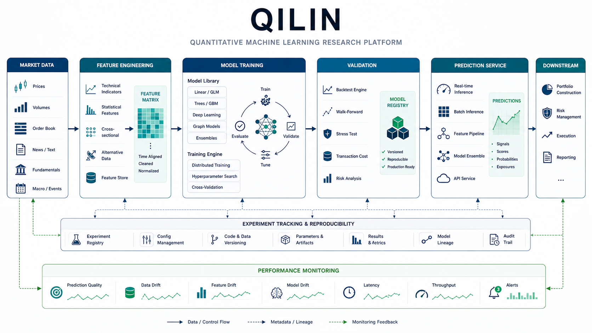

# QILIN

    

  <strong>Quantitative machine-learning workspace for factors, models, and experiment runs.</strong>

  

The overview figure lays out a production-minded research flow from market features to model training, validation, prediction, experiment tracking, and monitoring.

## Overview

QILIN is a compact quantitative ML workspace organized around reusable modules, factor inputs, model folders, and trial runs. It is built for iterative research: prepare factors, train candidate models, compare runs, and keep execution outputs separate from core code.

## What Is Included

- `BasicModule.py`: shared model or training utilities.
- `models/`: model definitions and experiment-specific architectures.
- `factors_single/`: single-factor inputs and processing assets.
- `trials/`: trial runs and experiment outputs.
- `run.py`: main execution entry point.

## Quick Start

1. `git clone git@github.com:Hik289/QILIN.git`
2. `python -m venv .venv && source .venv/bin/activate`
3. `python -m pip install -U pip numpy pandas scipy scikit-learn matplotlib torch`
4. Review `run.py`, configure the local data paths, and run a small trial before launching larger experiments.

## Suggested Workflow

1. Start with the smallest runnable script or notebook listed above.
2. Keep raw data paths and credentials outside the repository.
3. Save generated figures, tables, and reports under the existing result folders.
4. When an experiment becomes stable, record the exact data window, parameters, and command used to reproduce it.

## Repository Map

- `assets/readme-figure.png`: README overview figure.
- Project scripts and notebooks: core research entry points.
- Result or report folders: generated artifacts used for analysis and review.

## Paper or Reference

No external paper link is currently attached to this project. For now, the code, notebooks, and notes in this repository are the primary reference artifact.

## License

No explicit license file is included yet. Add one before public reuse, redistribution, or package release.

## Maintenance Notes

- Add a pinned environment file if this project is prepared for external installation.
- Keep large datasets outside Git and document where each script expects them locally.
- Prefer small, named experiment outputs over overwriting shared result files.
