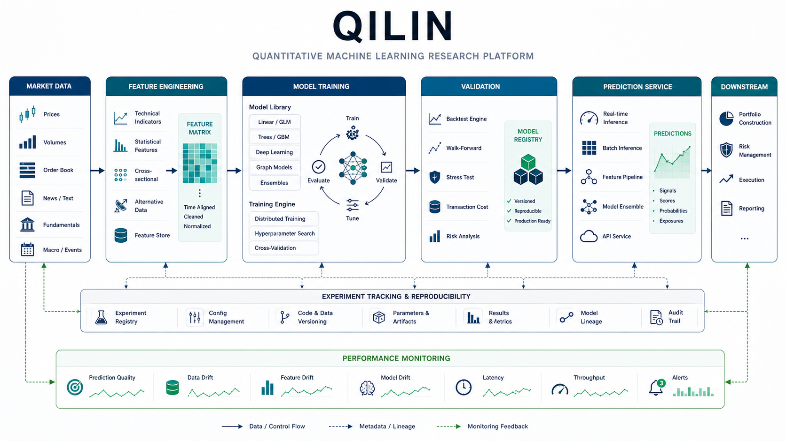

# QILIN

<p align="center">
  <a href="#license"></a> <a href="#paper-or-reference"></a> 
</p>

<p align="center">
  <strong>Quantitative machine-learning workspace for factors, models, and experiment runs.</strong>
</p>

<p align="center">
  
</p>

## Abstract

This repository is a conference-style artifact for quantitative ML experiments over factors, models, and trials. It packages the code and notes needed to inspect the central research question: How can factor inputs, model variants, and trial outputs be compared in one workspace? The emphasis is on transparent entry points, reproducible execution, and clear separation between code, local data, and generated outputs.

## Artifact at a Glance

| Item | Details |
| --- | --- |
| Research question | How can factor inputs, model variants, and trial outputs be compared in one workspace? |
| Primary artifact | Model code, factor folders, a run entry point, and trial outputs. |
| Main entry points | `run.py`, `BasicModule.py`, `models/`, `factors_single/`, `trials/` |
| Expected outputs | Model predictions, run logs, and trial comparisons. |

## Repository Structure

| Item | Details |
| --- | --- |
| `BasicModule.py` | shared model or training utilities. |
| `models/` | model definitions and experiment-specific architectures. |
| `factors_single/` | single-factor inputs and processing assets. |
| `trials/` | trial runs and experiment outputs. |
| `run.py` | main execution entry point. |

## Reproducibility Protocol

1. `git clone git@github.com:Hik289/QILIN.git`
2. `python -m venv .venv && source .venv/bin/activate`
3. `python -m pip install -U pip numpy pandas scipy scikit-learn matplotlib torch`
4. Review `run.py`, configure the local data paths, and run a small trial before launching larger experiments.
5. Record the data window, random seed, software versions, machine type, and exact command used for any full rerun.
6. Store regenerated figures, tables, checkpoints, or reports under the existing result folders instead of overwriting raw inputs.

## Evaluation Protocol

| Step | Reviewer-facing check |
| --- | --- |
| Environment | Confirm the listed runtime or notebook environment starts without modifying tracked files. |
| Minimal run | Execute the smallest entry point before launching longer experiments. |
| Output check | Compare regenerated files with the expected figures, tables, logs, or reports named in this README. |
| Extension check | Add new runs as separate scripts, notebooks, or result folders with explicit names. |

## Expected Results

- The main scripts or notebooks should regenerate the project-specific artifacts listed in **Artifact at a Glance**.
- Outputs should be traceable to a command, parameter setting, and data window.
- Any private data path or machine-specific setting should be documented before sharing the artifact externally.

## Paper or Reference

No external paper link is currently attached to this project. For now, the code, notebooks, and notes in this repository are the primary reference artifact.

## Citation

If this repository supports a paper, cite the paper first and the artifact version second. If no paper is attached, cite the repository snapshot used in the experiment.

```bibtex
@misc{qilin_artifact_2026,
  title = {{QILIN}},
  author = {Hik289},
  year = {2026},
  howpublished = {\url{https://github.com/Hik289/QILIN}},
  note = {Conference-style research artifact}
}
```

## License

No explicit license file is included yet. Add one before public reuse, redistribution, or package release.

## Reviewer Checklist

| Claim | How to inspect it |
| --- | --- |
| Code availability | Code and notebooks are present in the repository. |
| Reproducibility | The protocol above gives the expected setup and run order. |
| Result traceability | Generated outputs should live in named result, report, log, or output folders. |
| Extensibility | New experiments should preserve existing artifacts and add clearly named outputs. |
